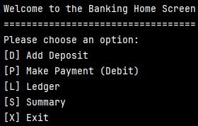
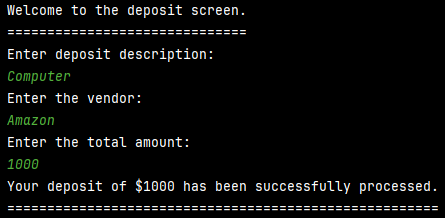
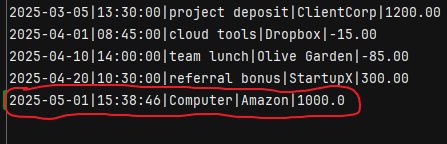
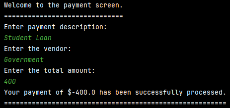
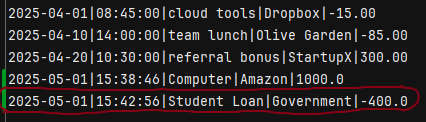
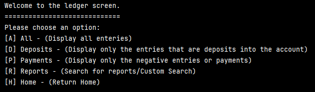
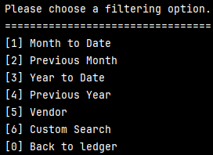
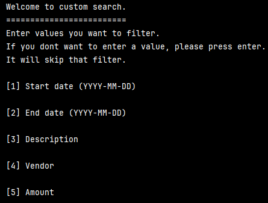
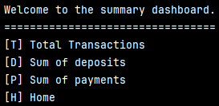

<h1 align="center">💳 Java Banking Ledger</h1>
<h5 align="center">By: Kenny Lin</h5>

  A command-line Java app to manage your financial transactions with elegance and ease. ✨

  
  
  

---

## 🌟 Features

✅ Load transactions from a CSV file  
💾 Save deposits and payments directly to the CSV file  
📊 View all, deposit-only, or payment-only transactions  
🔎 Filter by **vendor**  
📆 Track totals (deposits/payments) for **this month** and **this year**  
🛡️ Error handling and input validation

---

## 📋 Main Menu - Display

---

## 🖼️ Banking Leger -  Options

Below are the options available in the banking ledger application. Each section includes a visual representation of the user interface for better understanding.

### 1. **Add Deposit [D]**

*This image shows the "Add Deposit" option, where users can add a deposit to their ledger.*

*This image shows that the deposit transaction is now also reflected on the "transaction.csv"*

### 2. **Make Payment (Debit) [P]**

*Here’s the "Make Payment" option, allowing users to make a payment (debit) transaction.*

*This image shows that the payment transaction is now also reflected on the "transaction.csv"*'

### 3. **Ledger [L]** 
#### *-Includes the Challenge Option(Custom Search)*

*This image displays the "Ledger" option, where users can view all transactions in the ledger.*

####  *Custom Ledger Search* 

  
  

### 4. **Summary [S]** 

*Here’s the "Summary" option, which shows the financial summary of transactions and balances.*

